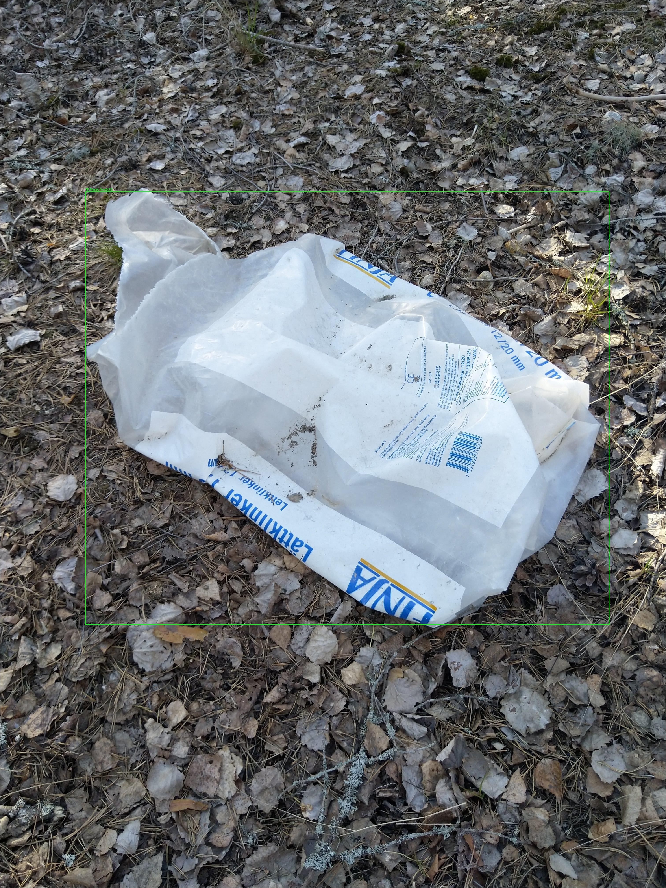
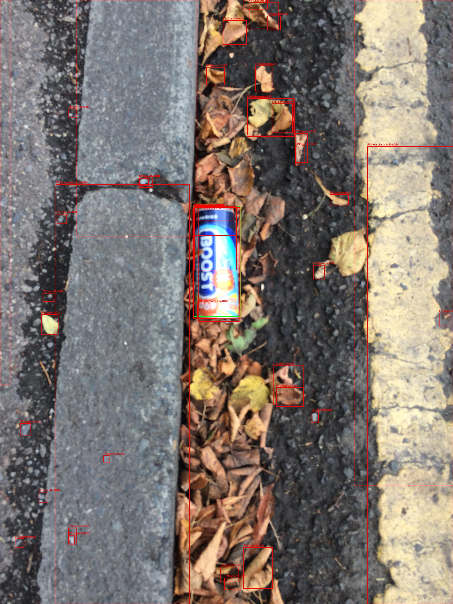
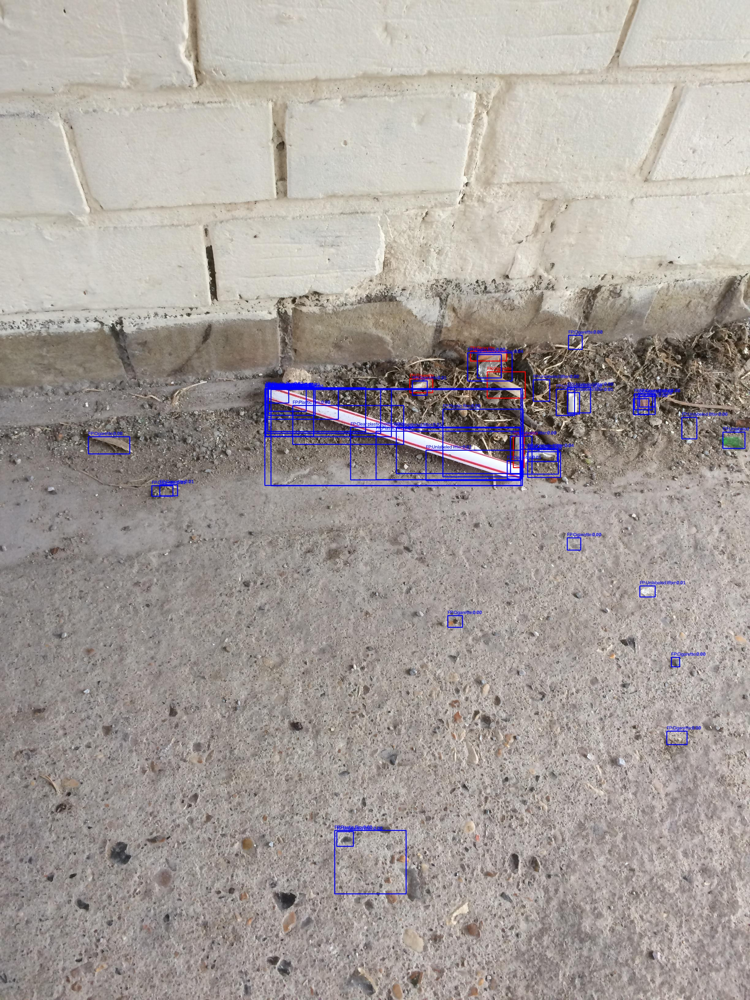

# YOLO Model Optimization Portfolio

[](https://github.com/QiuweiLiu/YOLOportfolio/actions/workflows/tests.yml)

[English](README.md) | [简体中文](README.zh-CN.md)

A practical object detection optimization workflow with dataset audit, frozen evaluation splits, FP/FN diagnosis, hypothesis-driven controlled experiments, and reproducible before/after evaluation.

> **Result (frozen 8-class val, same split): mAP50 0.238 → 0.315 (+32%)** — baseline 416px vs best 640px, see [`assets/results/`](assets/results/) for auditable `evaluation.json`.

**What this demonstrates:** Given an existing YOLO detection task, systematically identify problems through data analysis, establish a frozen baseline, diagnose False Positive / False Negative errors, design hypothesis-driven experiments, and validate improvements on a fixed evaluation set.

**Interview-ready case study:** [30-second / 1-minute / 3-minute project walkthrough + technical Q&A](docs/INTERVIEW_GUIDE.md)

### Demo

<div align="center">
  
  <p><em>Balanced case: Green TP / Red FP / Blue FN — 1 TP, 0 FP, 0 FN (val/000083.jpg, best.pt 640px)</em></p>
  
  
  <p><em>Red: False Positive | Blue: False Negative | Green: True Positive</em></p>
</div>

### Video Demo

[](assets/video_demo.mp4)

*5-second demo: 8-class litter detection on TACO validation images (YOLOv8n, 640px). Click image to play — [direct link to MP4](assets/video_demo.mp4) | Preview: `assets/hero_demo2.jpg`*

*Generated via `python yolo_optimization/scripts/inference.py --weights yolo_optimization/results/experiments/exp_a_imgsz640/weights/best.pt --source outputs/demo_input.mp4 --output outputs/demo` — see `assets/video_demo.mp4` (4.4 MB).*

### Case Study: TACO Litter Detection

The [TACO dataset](http://tacodataset.org/) (Trash Annotations in Context) contains 1,500 images of litter in natural environments with 60 fine-grained categories and 4,784 annotations.

**Challenge:** 38 out of 60 classes have fewer than 50 instances each — extreme class imbalance makes full 60-class detection impractical. [The official paper](https://arxiv.org/abs/2003.06975) reports only 17.6% AP using Mask R-CNN at 1024×1024 resolution.

### Task Scope Study

The first step was auditing the dataset to determine the appropriate task scope:

| Scope | Classes | Criteria | mAP50 | Interpretation |
|---|---|---|---|---|
| Full taxonomy | 60 | All classes | 0.086 | Severe long-tail / scope study |
| Filtered scope | 23 | ≥50 instances | 0.140 | Scope study only |
| Focused task | **8** | **≥200 instances** | **0.244** | Selected task definition |

> Metrics across different class scopes are NOT direct model optimization comparisons. This study shows why the full 60-class taxonomy is not suitable and how the focused 8-class task was chosen as the final benchmark.

The final task (`task_v1`) focuses on the 8 most common litter classes:
Clear plastic bottle, Plastic bottle cap, Drink can, Other plastic, Plastic film, Other plastic wrapper, Unlabeled litter, Cigarette

### Frozen Baseline

The evaluation split is fixed via a [data manifest](yolo_optimization/data_manifests/task_v1.json) — all experiments use the exact same train/val/test images (640/80/80).

| Metric | Value |
|---|---|
| Model | YOLOv8n (3.0M params) |
| Input size | 416×416 |
| Training | 30 epochs, batch 8, seed 42 |
| **mAP50** | **0.238** |
| **mAP50-95** | **0.181** |
| **Precision** | **0.400** |
| **Recall** | **0.266** |

*Metrics from `evaluate.py` on frozen validation set (best.pt).*

### Error Analysis

Threshold-based matching (IoU ≥ 0.5, conf ≥ 0.001) on frozen val set — distinct from Ultralytics AP validation metrics.
Diagnostic TP/FP/FN statistics are used for failure analysis and may differ from COCO-style AP evaluation.

**Object Size Distribution** (204 val instances):

| Size | Count | % |
|---|---|---|
| Tiny (<1% image area) | 154 | 75.5% |
| Small (1-5%) | 28 | 13.7% |
| Large (>5%) | 22 | 10.8% |

**Key findings:**
- **Cigarette** is the hardest class: 53 instances, 5 TP / 48 FN (recall 0.09, precision 0.00). Most are tiny.
- **Clear plastic bottle** performs best: 13 instances, 12 TP / 1 FN (recall 0.92, precision 0.04 at low threshold).
- 75.5% of all objects are tiny — small object detection is the primary bottleneck.

### Optimization Results (same task, same split)

| Model | mAP50 | mAP50-95 | Precision | Recall |
|---|---|---|---|---|
| Baseline (416px) | 0.238 | 0.181 | 0.400 | 0.266 |
| **Best (640px)** | **0.315** | **0.233** | 0.306 | 0.346 |

*Best model: `exp_a_imgsz640` (hypothesis: higher resolution helps tiny objects). All metrics from `evaluate.py` on frozen val.*

### Deliverables

For a client project you receive:

- trained YOLO weights (`best.pt`)
- reproducible training configuration (`baseline_v1.yaml`)
- evaluation report (`evaluation.json`)
- FP/FN failure analysis (`error_analysis.json` + 10 example images)
- inference script (`inference.py` — single image / directory / video)
- optimization recommendations (based on error analysis)

### Scripts

| Script | Purpose |
|---|---|
| [`train.py`](yolo_optimization/scripts/train.py) | Train YOLO with auto device selection, metrics logging |
| [`evaluate.py`](yolo_optimization/scripts/evaluate.py) | Evaluate best.pt on frozen val/test → standardized evaluation.json |
| [`analyze_errors.py`](yolo_optimization/scripts/analyze_errors.py) | FP/FN analysis with per-class stats, size analysis, visual examples |
| [`inference.py`](yolo_optimization/scripts/inference.py) | CLI inference on images/video → annotated output + detections.json |
| [`compare_runs.py`](yolo_optimization/scripts/compare_runs.py) | Compare multiple evaluation.json → comparison table |
| [`prepare_dataset.py`](yolo_optimization/scripts/prepare_dataset.py) | COCO→YOLO conversion with frozen manifest support |
| [`analyze_dataset.py`](yolo_optimization/scripts/analyze_dataset.py) | Dataset statistics (class distribution, bbox size, aspect ratio) |
| [`check_environment.py`](yolo_optimization/scripts/check_environment.py) | Verify environment (fresh clone compatible) |

### Quick Start

```bash
git clone https://github.com/QiuweiLiu/YOLOportfolio.git
cd YOLOportfolio

# 1. Create environment (Python 3.11)
conda env create -f environment.yml
conda activate yolo-portfolio

# 2. Verify environment
python yolo_optimization/scripts/check_environment.py

# 3. Download TACO dataset
# (requires ~2.7GB, see TACO official repo for download options)

# 4. Prepare data with frozen manifest
python yolo_optimization/scripts/prepare_dataset.py \
  --annotations data/raw/taco/annotations.json \
  --images-dir data/raw/taco/images \
  --output-dir data/processed \
  --name taco_v1 \
  --manifest yolo_optimization/data_manifests/task_v1.json

# 5. Train baseline
python yolo_optimization/scripts/train.py \
  --data data/processed/taco_v1/dataset.yaml \
  --model yolov8n.pt \
  --epochs 30 --imgsz 416 --batch 8 --seed 42

# 6. Evaluate
python yolo_optimization/scripts/evaluate.py \
  --weights yolo_optimization/results/experiments/exp/weights/best.pt \
  --data yolo_optimization/data_manifests/task_v1.json \
  --split val

# 7. Error analysis
python yolo_optimization/scripts/analyze_errors.py \
  --weights yolo_optimization/results/experiments/exp/weights/best.pt \
  --data yolo_optimization/data_manifests/task_v1.json \
  --split val

# 8. Run inference on your own images
python yolo_optimization/scripts/inference.py \
  --weights yolo_optimization/results/experiments/exp_a_imgsz640/weights/best.pt \
  --source path/to/your/image.jpg
```

### Project Structure

```
YOLOportfolio/
├── yolo_optimization/
│   ├── scripts/          # Training, evaluation, analysis, inference
│   ├── configs/          # Experiment configuration files
│   ├── data_manifests/   # Frozen task definitions (splits, class mapping)
│   ├── results/          # Experiment outputs (gitignored)
│   └── tests/            # Unit tests
├── assets/               # Selected results for README
├── docs/                 # Interview guide and project notes
├── requirements.txt      # Locked dependencies (Python 3.11)
├── environment.yml       # Conda environment
└── LICENSE               # MIT
```

### Hardware

Developed on **Apple Silicon (MPS)** — torch 2.13 / Ultralytics 8.4.121 / Python 3.11. Compatible with NVIDIA CUDA (auto-selects cuda → mps → cpu).

### License

- Code: MIT (see [LICENSE](LICENSE))
- TACO dataset: CC BY 4.0